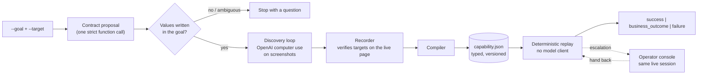
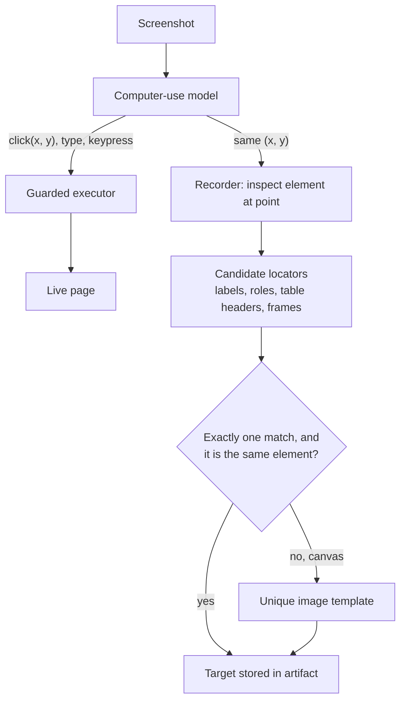
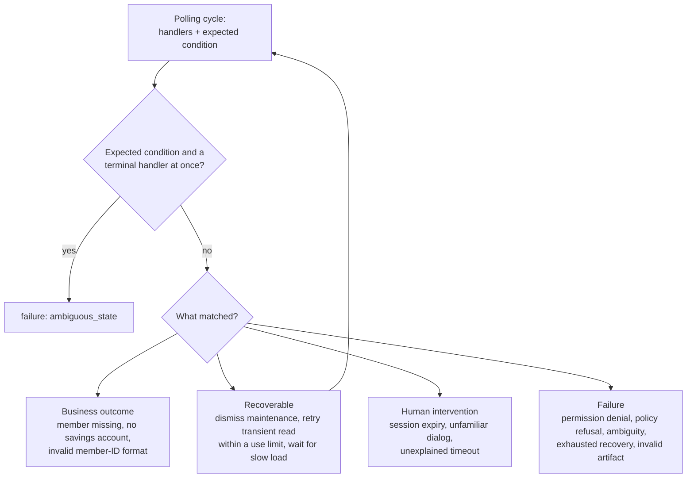
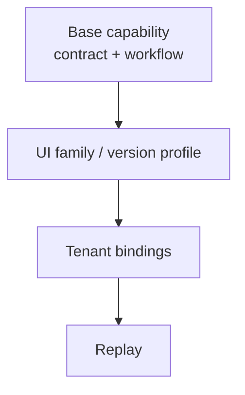
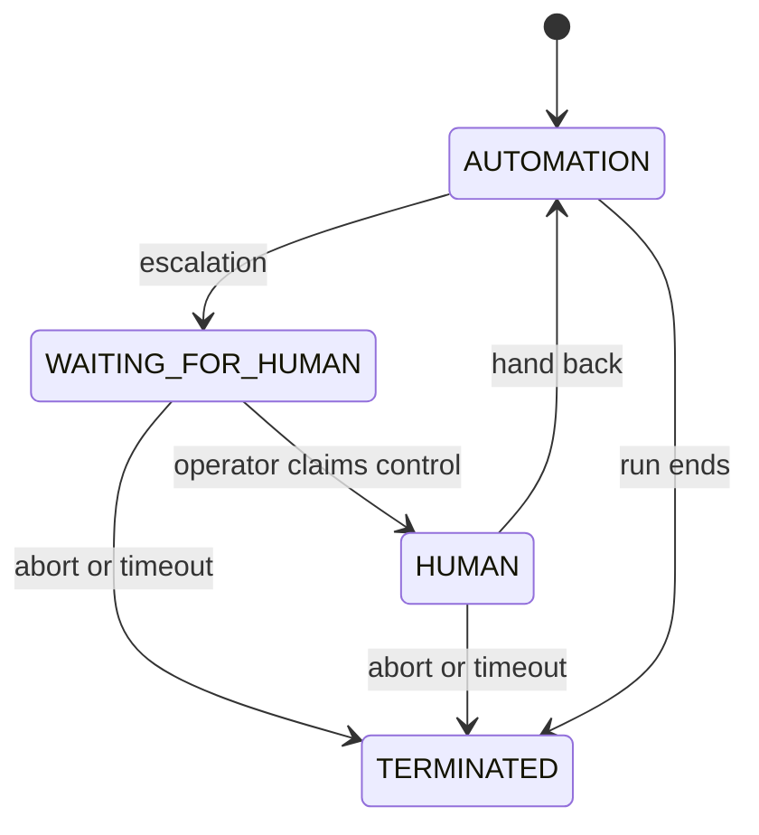

# Computer-use automation system: design report

## 1. Architecture

Discovery, replay, the browser session and operator control all run in one Python process. The synthetic target
application runs in another. `domain/` holds the artifact and result contracts, `ports/` the interfaces for the
surface, model, evidence and interventions, `application/` the use cases, and `adapters/` the OpenAI, Playwright,
OpenCV, JSONL storage and operator console implementations. `bootstrap.py` connects them. State is kept in files and an
in-memory inbox, since this demonstration has no use for a database or a queue.

A task is described by a free-text `--goal` and a `--target`. One strict function call proposes the contract, meaning
the parameters and their literal values, the outputs, and the parameter that identifies the record. Code throws out any
value that does not appear in the goal, writes the accepted ones as `{{inputs.<name>}}` wherever they are persisted, and
marks every output as sensitive. When the goal is ambiguous, discovery stops and asks a question.

The computer-use model then works from screenshots, the parameterized goal and the output descriptions. It never sees
the DOM, selectors or the repository. It acts with the `computer` tool and reports back with `report_output`,
`report_identity`, `finish` and `request_help`. Real values replace the placeholders just before text is typed.

The contract and the navigation, extraction and identity targets are learned from the goal and the run. Error handlers,
their outcome codes, masking regions and permissions are written by hand as per-application configuration with default
paths, and every goal reuses them. A single successful run cannot show exceptions it never hit, so these have to be
authored. The provider and model can be changed in configuration, and token usage is recorded in
[the evidence manifest](evidence/manifest.json).

## 2. Main decisions

### 2.1 Screenshots instead of the DOM or accessibility tree

The model decides what to do by looking at screenshots. We did not give it the DOM or the accessibility tree because
the target is a legacy back office, where those views are at their worst. Controls drawn on a canvas have no DOM nodes
and no accessibility entries, so pixels are the only way to find them. Iframes, nested layout tables, non-semantic
markup and generated IDs make the tree large, which costs tokens, while telling the model little about what each
element does. A screenshot shows the same thing a human operator sees, and the idea still works on desktop
applications, where there is no DOM. It also keeps text that exists in the markup but is not displayed away from the
model. Text that is displayed can still carry an injected instruction, and the policy allowlist in section 7 handles
that case.

The page structure is still used after the model has decided. When the model clicks a coordinate, the recorder looks
at the element under that point and turns it into locators that replay can find again.

### 2.2 Why we did not build Set-of-Mark or use OmniParser

Set-of-Mark is a common way to get accurate clicks from a model. You detect the interactive elements, draw a numbered
mark on each, let the model answer with a number and translate that number back into a position. The elements can come
from the DOM or from a vision model such as OmniParser, which Microsoft released as open source.

OpenAI's computer-use tool already does this job. It takes the screenshot and returns the coordinates to click, and our
adapter passes a `click` action straight through as `Point(x, y)`. Building Set-of-Mark ourselves would have meant
writing detection, drawing the marks and mapping them back to coordinates, plus hosting and tuning OmniParser if we
went that way. That is a lot of code to own for a result the API already returns. A DOM-based version would also hit
the canvas and markup problems from 2.1.

Nothing here prevents a change later. The model is behind `ports.model.ComputerUseAgent`, and adding a provider takes
one registration in `agents.py`, so a local model or a Set-of-Mark adapter could be plugged in without touching
discovery, the compiler or replay.

### 2.3 Session control for a human operator

Some situations need a person. When the session expires, someone has to sign in again, and the automation does not
have the credentials. An unfamiliar dialog or a timeout nobody can explain calls for judgment. Restarting would waste
the part of the workflow that already ran.

So the person takes over the browser session that is already open. In the operator console they claim control, look at
a masked screenshot, click, type, press keys and scroll, then give control back or abort. Only one side can act at a
time, and an old browser tab cannot send an action after control has changed hands. Human actions pass through the
same policy check as automated ones (`human_effects` in `configs/policy.json`), so taking over does not bypass the
rules. Section 6 explains how this works.

### 2.4 A demo application to run the tool against

We had no real legacy back office or member data to test with, and real data would conflict with the safety
requirements. `demo_app/`, the "Legacy Credit Union Desk", is a synthetic application with the features that make old
UIs hard to automate, namely iframes, nested tables, non-semantic markup, generated IDs and a canvas control. The
automation can only learn its server-side state through the UI.

The `--scenario` flag turns on one exception at a time. The options are `normal`, `maintenance`, `slow`,
`transient_error`, `session_expired`, `permission_denied`, `unknown_dialog`, `canvas_shift`, `duplicate_canvas_control`
and `injection`. This lets anyone reproduce each row of the evidence table, keeps the data sent to the model synthetic,
and lets the integration tests run the same flows in Chromium.

### 2.5 Related research and prior work

I am researching how to make LLMs better at computer use, and I considered giving the model system events alongside or
instead of screenshots. Screenshots sent to OpenAI computer use were enough for this challenge. The recorded discovery
took 7 turns, and replay makes no model calls.

Before this project I built a similar tool, [qa-agent-py](https://github.com/eljonathas/qa-agent-py), an autonomous QA
agent that drives a browser through Playwright. It used Set-of-Mark, giving each interactive element an ID and a colored
label on the page so the model could choose elements by ID. Having built that once is part of why this project leaves
element location to the provider.

## 3. Artifact schema

The [generated capability](evidence/capability/capability.json) is typed JSON. Pydantic validates it without relying
on the model transcript. It has these sections:

- `schema_version`, `capability_version`, `provenance`: versions of the format and behavior, and the discovery it came from.
- `contract`: parameterized goal, string inputs (`identifies_record`), output parsers, sensitivity and business outcomes.
- `application`, `entry`: required surface features, entry path and environment bindings.
- `targets`, `steps`: ordered targeting strategies, rationale, actions, effects, pre- and postconditions, retry limits.
- `handlers`, `success`, `extractions`: exceptional states, final checkpoint and output locations.

Before a model click runs, the recorder inspects the element at that point and keeps only locators that find exactly
that element. Labels, roles, table headers and named frames are used instead of generated IDs. When a row key matches
an input, it is stored as a reference to that input so that a different member selects a different row, and the fixed
fallbacks are removed. Rows whose key is literal text without digits are treated as labels, which is a heuristic and
not PII detection. Canvas controls are found with an image template that has to match exactly once.

The identity check is learned in the same way. The model points to where the opened record displays an identifying
input, and the recorder reads that spot again at the end. It refuses text fields and row keys built from the same input,
because those would match every time.

The compiler merges consecutive edits and removes focus clicks that do nothing. It refuses to produce an artifact when a
target is unresolved, an output or the identity is missing, table outputs in one frame come from different rows, or the
discovery depended on human actions it cannot compile. Validation also rejects references to undefined targets, inputs
or outcomes, and unknown major schema versions. Template images are checked against their hashes. Replay interprets the
artifact, which contains no Python code and no free-form selectors.

## 4. Determinism and error handling

Replay never creates a model client. For each step it checks the precondition, resolves a single target, runs the
action through the policy check and waits for the postcondition. The last checkpoint compares the identity shown on
screen with the input and confirms the outputs are visible. The row key found during discovery
(`Account type = Savings`) picks the account, and typed parsers read the values. Replay stops if a target matches more
than one element, and it only tries a fallback strategy when every earlier one found nothing.

Each polling cycle checks the known handlers together with the expected condition, and the outcome lands in one of four
groups.

Retries depend on what kind of effect the action has, and submits are never retried. Discovery waits 300 ms for the page
to settle and checks that frames have loaded. Replay polls for conditions instead.

The [evidence](evidence/README.md) folder holds one real discovery and 12 replays of the artifact it produced. The
script that generates it checks the expected status and code, the outputs that were actually returned, whether the run
was assisted, and the failure screenshots. The successful replays use a different member than discovery did, and the
business cases use missing, malformed or no-savings inputs.

## 5. Heterogeneity and multi-tenant

The surface ports keep screenshots, raw input, inspection, locating, element actions, probes and navigation separate
from the workflow logic. The adapter we built targets legacy web pages with iframes, nested tables, non-semantic
markup, generated IDs and canvas. Replay refuses an artifact that declares a surface feature the adapter lacks.

A desktop adapter would use the operating system's accessibility and input APIs and target windows instead of frames,
with OCR for extracting values from pixels. It would also need desktop versions of navigation and predicates, and the
same-row validator, which only works on the web today, would have to be generalized. We do not expect a web artifact to
run as-is on desktop. The contract and the steps of the workflow can be reused, but the targets have to be found and
validated again for the new surface.

When several tenants use the same vendor product, the design stacks three layers.

Right now `base_url` is supplied when replay starts, and authored handlers are copied into the artifact at compile time.
Locale, credential references, restricted target overrides and version landmarks are only proposals. An override may
never relax the policy or change the output contract. To catch UI changes over time, we propose checking landmarks on
the entry page, aggregating target failures, testing on one tenant before the others, and promoting or rolling back
capability and binding pairs by version.

## 6. Escalation and handoff

Discovery asks for help when the model calls `request_help`, when the provider raises a safety check, or when actions
repeat without any visible change. Budgets and idle limits end the run with an explicit reason. Replay escalates
through handlers or unmet conditions if an operator channel is configured, and otherwise returns a failure result.

`SessionControl` moves between these states.

Actions and control changes take the same lock. Every change bumps an epoch number, which makes older tokens invalid,
and only one operator can hold control. The intervention request includes the capability, the reason, the step when it
is known, a masked screenshot and what will happen on resume. The console only listens on the loopback interface and
is protected by an access token, HttpOnly and SameSite cookies, CSRF checks and screenshot revision numbers. Human
actions run through the same checked browser session and are logged, with typed text recorded only as a length.

Once control comes back, replay checks the condition it was waiting for, and if that still fails it restarts from a
declared safe point. Aborting or letting the intervention time out ends the session. Discovery drops any pending
actions and takes a new observation.

One detail of the OpenAI API shaped this part. The live computer API does not accept user images together with
`previous_response_id`. When the model has answered only with function calls, the runner asks for a computer
screenshot, and in that turn the model can neither act nor finish. The screenshot goes back as `computer_call_output`,
and only then does the model decide again, following the
[computer protocol](https://developers.openai.com/api/docs/guides/tools-computer-use).

In the evidence run, a person did the handoff in the operator console while the script waited. Adapter and runner tests
cover the new observation after handoff, and the real discovery also went through the function-to-screenshot exchange.

## 7. Safety

The policy lists, for each actor, the allowed origins, paths, commands, keys and effects. The executor checks it
before every action, and the browser intercepts and blocks requests that fall outside it. Service workers and downloads
are turned off, and any extra page that opens is closed. Irreversible or unknown effects are blocked for people and
automation alike. Effects are classified from control names and roles, and in this demo canvas clicks are trusted as
navigation. In replay, a click is classified from the target recorded in the artifact and its effect, so a modified
artifact would not be detected.

Sensitive inputs are registered before execution, and sensitive outputs before any result is written. The caller gets
the balance, but the saved result only has a redaction marker. Discovery logs do not include model messages, finish
summaries or safety-check text, since any of these can repeat what was on screen. Help reasons from the model stay in
memory for the operator, and the evidence uses fixed reason codes instead. Model text is printed to the terminal only
when `console.model_decisions` is on. Actions, verification events, target rationale and usage are still logged for
debugging.

Screenshots are masked with configured regions that cover every result row, and if a locator fails, no evidence is
captured. All data is synthetic. No HAR files, traces, storage state or browser profiles are saved. Before export, the
text files are scanned for synthetic identifiers, names, birth dates, SSNs and balances.

Masking only works if the application profile is correct, and it does not find PII in general. The model still sees
synthetic names and balances in its screenshots. A production deployment would need a reviewed data-handling
agreement, better action classification, artifact approval and network isolation below the browser level. For the
injection test, a real discovery ran on a page that tells agents to leave the application, and the allowlist would
block that request if the model obeyed.

## 8. Cuts

We built one application and one read-only capability, with real discovery, deterministic replay, exception handling
and handoff on the live session. The recorder handles clicks, typing, Enter, Tab and Escape, but not dragging or key
combinations.

We chose not to build desktop and OCR support, tenant overrides and version detection, approval gating, a capability
catalog, crash recovery, a fallback to the LLM during replay, or scoring stability across many runs. The operator UI is
basic, and the session is lost if the process crashes. A discovery that needed human help can continue, but it cannot
produce a capability that includes manual actions the compiler does not understand.

Next we would add repeated replay validation with approval states, followed by restricted tenant variants and
intervention state that survives restarts. Browser integration tests use a scripted model and are kept apart from the
real LLM evidence. Run `uv run pytest`, `uv run ruff check src tests scripts` and `uv run mypy src`. The README has the
commands to reproduce everything.
